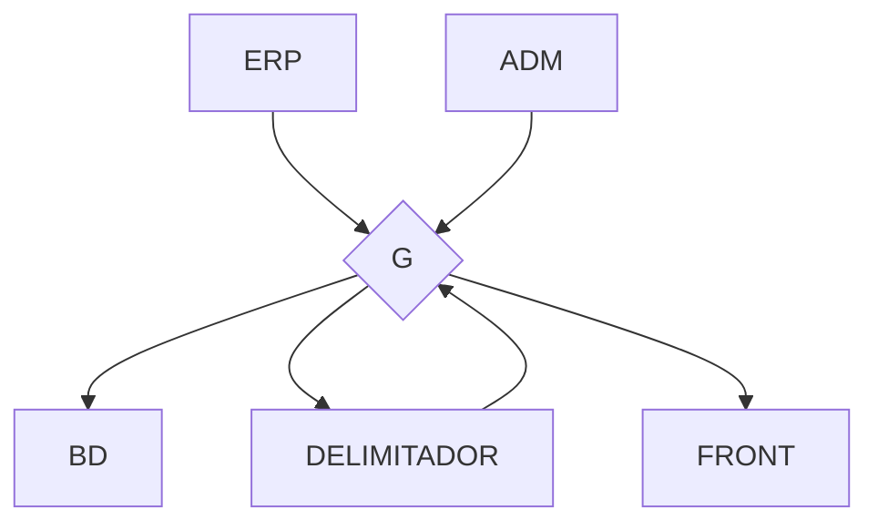

# Nome do Projeto

Fornece o serviço de controle de estoque, auxilia indicando se tem muito ou pouco estoque e simula serviços de terceiros para teste.

## Índice

2. [Arquitetura](#arquitetura)
3. [Tecnologias Utilizadas](#tecnologias-utilizadas)
4. [Configuração e Instalação](#configuração-e-instalação)
   - [Requisitos](#requisitos)
   - [Backend](#backend)
   - [Frontend](#frontend)
5. [Uso](#uso)
6. [Licença](#licença)

---

## Arquitetura



[Descrição dos componentes](arquitetura.md)

### O Único serviço prestado pelo servidor é o de setup
Nelo, onde o frontend envia qual é o nome do usuário, e com base nisso o servidor compila as informações necessárias, primeiramente no banco de dados:
1° Obtém quais são os grupos de acesso que o usuário tem acesso
2° Obtém todos os produtos dos quais os grupos de acesso tem acesso
3° Retorna nome, preço, probabilidade de perder 1, quantidade demandada, a receber e atual.
Então obtém as informações financeiras da empresa do erp: c, wi, we, nopat, ki, ke, p, pl, invs.
Com todas essas informações, ele envia para o [delimitador](./delimitador/DELIMITADOR.md), que retorna a quantidade minima e maxima ideal para cada produto.
Após obter todas as informações necessárias, é enviado para o frontend as seguintes informações de cada produto:
- nome
- quantidade em estoque
- quantidade a receber
- quantidade demandada
- situação
onde situação indica se quantidade em estoque + a receber está abaixo do limite inferior, acima do limite superior ou está nos conformes e é renderizada no frontend.

---

## Tecnologias Utilizadas

### Backend
- [Express](https://expressjs.com)  
- [Sequelize](https://sequelize.org)  
- [Docker](https://www.docker.com)  

### Frontend
- [Electron](https://www.electronjs.org)  

---

## Uso

1. Clone o repositório:
   ```bash
   git clone https://github.com/usuario/backend-repo.git
   
